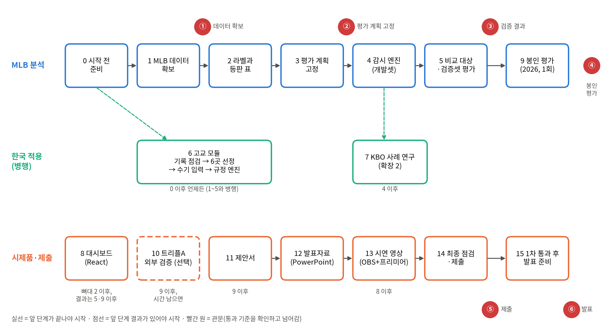

# PitchSignal 피치시그널

투구 추적 데이터로 투수마다 '평소의 투구'를 학습하고, 오경보율을 미리 정한 다변량 관리도
(가변 표본 T²·MEWMA)로 '평소와 달라진 등판'을 알리는 투구 이상 신호 모니터링 시스템.
2026 경기스포츠산업 공모전 출품작 · 김형준 (UNIST, robin1967@unist.ac.kr)

> 부상을 진단하거나 예측하지 않는다. 통계적 관리도가 점검을 시작할 신호를 내고, 판단은 사람이 한다.



## 시작하기 (Windows)
```powershell
# Python 3.12 이상(3.13에서 확인), Git, Node.js LTS 설치 후
py -m venv .venv
.venv\Scripts\Activate.ps1          # 막히면: Set-ExecutionPolicy -Scope CurrentUser RemoteSigned
pip install -r requirements.txt
python -m pytest -q                 # 모두 통과해야 함
```

## 진행 방법
1. 단계를 번호 순서대로 진행한다.
2. 모든 단계는 `docs/SPEC.md`의 명세와 `config.yaml`의 설정을 따른다.
3. 관문 ①~⑤(데이터 확보 → 평가 계획 고정 → 검증 결과 → 봉인 평가 → 제출)를 통과하며 진행한다.

## 폴더
| 경로 | 내용 |
|---|---|
| `config.yaml` | 모든 선택값과 숫자 설정 (평가 계획 고정 뒤 변경 없음) |
| `config_scout.yaml`, `config_kbsa.yaml` | 화면 5 영입 전 점검 대상 목록, 2025 전국체전 기록 변환 설정 (평가 설정과 분리) |
| `docs/SPEC.md` | 명세서 |
| `src/core/` | 검증된 참조 구현 (수정 금지): 핵심 통계 함수, KBSA 규정 엔진 |
| `tests/` | 참조 구현 테스트 |
| `tools/sim_short_outings.py` | 짧은 등판 처리 방식 비교 시뮬레이션 |
| `templates/` | 고교 기록 점검표·투구수 입력 Excel, 평가 계획서 양식 |
| `.github/workflows/deploy-pages.yml` | 대시보드 GitHub Pages 배포 |

## 데이터와 이용 조건
- MLB Statcast(Baseball Savant), MLB Stats API: 비상업 연구 목적으로만 사용, 원데이터는 저장소에 올리지 않음
- 고교 기록(KBSA 기록실 공식 경기 기록, 1회 수집·원본 비공개): 학교는 실명, 선수는 등번호로만 표시하고 선수 실명은 저장소 어디에도 두지 않음
- 공개하는 것은 코드, 설정, 집계 결과, 대시보드용 요약 JSON뿐
