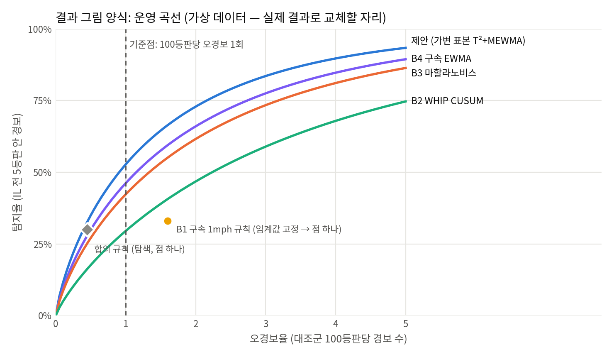
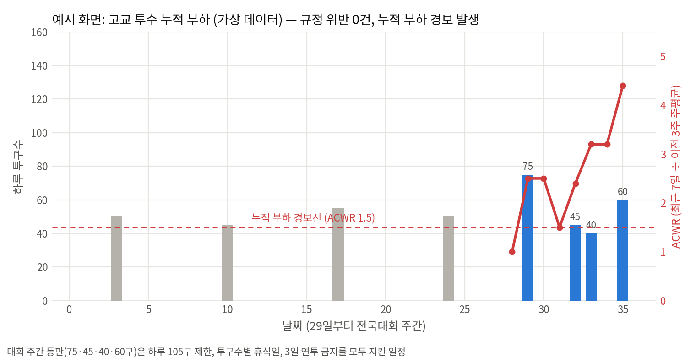
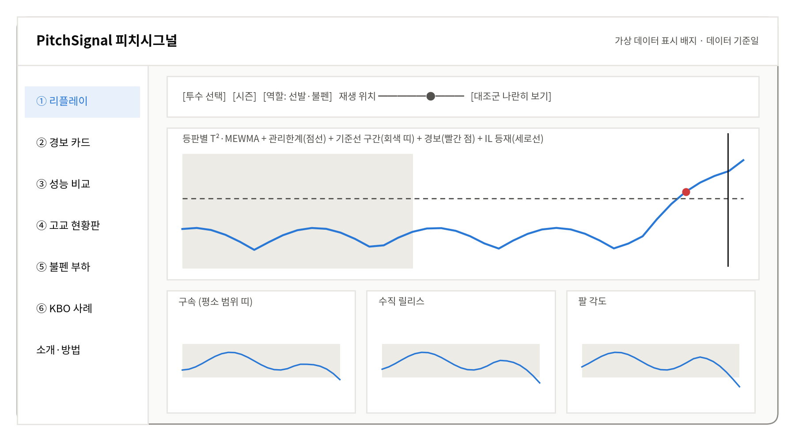

<!-- 자동 생성 파일: 실행기획서와 같은 내용. 수정은 기획서 원본에서 -->
# 피치시그널 명세서 (SPEC)

실행기획서 3장 '방법론 명세'와 같은 내용이다. 숫자는 config.yaml이 우선한다. 절 번호(3.x)는 실행기획서와 같다.

이 장은 코드를 짤 때 따르는 명세다. 스타터 묶음의 docs/SPEC.md와 내용이 같다. 숫자 설정은 모두 config.yaml에 있으며, 아래 표의 값과 다르면 config.yaml이 우선한다.

## 3.1 데이터

**표 1. 사용 데이터**

| 데이터 | 출처 | 내용 | 범위 |
|---|---|---|---|
| 투구 추적 | Baseball Savant, pybaseball | 투구별 구속, 회전수, 릴리스 위치, 익스텐션, 팔 각도, 투구 위치, 구종, 결과 | 2021~2026 정규시즌 |
| 선수 이동 기록 | MLB Stats API transactions | IL 등재일, 소급일, 설명 문구(부위·좌우) | 2021~2026 |
| 선수 정보 | MLB Stats API people | 생년월일(나이 계산), 투구하는 손 | 분석 대상 투수 |
| 고교 투구수 | KBSA 홈페이지 경기 기록 | 경기별 투수 투구수·아웃 수·날짜 | 경기도 6개교 2026 시즌 |
| KBO 사례 | 네이버 문자중계 기반 공개 코드 | 투구별 구속·구종 | 세 투수 2025~2026 |
| 외부 검증 (선택) | Savant 마이너리그 검색 | 트리플A 투구 단위 | 가능 범위 확인 후 |

**이용 조건**: MLB 약관은 개인·비상업 이용을 전제로 하고 자동 수집을 제한한다. 공모전에서는 연구 목적으로만 쓰고 원데이터는 저장소에 올리지 않는다. 공개하는 것은 코드, 설정, 집계 결과, 대시보드용 요약 JSON뿐이다. 사업화 단계에서는 구단이 보유한 자체 트래킹 데이터를 입력으로 쓴다고 제안서에 밝힌다. KBSA 기록과 네이버 문자중계도 소량·비상업으로 수집하고 원데이터는 공개하지 않는다.

## 3.2 등판 표 (data/processed/outings.parquet)

모든 분석은 '투수 × 경기' 한 줄짜리 등판 표에서 시작한다. 주력 패스트볼 특징은 그 등판의 주력 패스트볼 투구만으로, 투구 수와 결과 지표는 전 구종으로 계산한다.

**표 2. 등판 표의 열**

| 열 | 뜻 | 계산 |
|---|---|---|
| pitcher, season, game_pk, game_date | 투수 ID, 시즌, 경기 ID, 날짜 | Statcast 그대로 |
| role | 시즌 역할 (SP/RP) | 3.4절 |
| is_start | 이 등판이 선발 등판인지 | 3.4절 |
| primary_fb | 투수-시즌의 주력 패스트볼 구종 | FF·SI·FC 중 그 시즌 최다 |
| n_fb | 이 등판의 주력 패스트볼 투구 수 | 개수 |
| n_all | 이 등판의 전 구종 투구 수 | 개수 (부하 채널용) |
| eligible | 적격 등판 여부 | n_fb ≥ config.features.min_fastballs |
| velo, rel_z, arm_angle | 핵심 3개 특징 (F1~F3) | 주력 패스트볼 평균 |
| rel_x, extension, spin, rel_z_sd | 전체 7개의 나머지 (F4~F7) | 평균 (rel_x는 좌투 부호 반전), rel_z_sd는 n_fb ≥ 10일 때만 |
| high_rate, out_zone_rate | 어깨 하위 분석용 (F8·F9) | 3.5절 |
| h, bb, outs | 피안타, 볼넷(고의4구 포함), 잡은 아웃 | events 열에서 집계 (B2용, 3.12절) |
| pitches_json (선택) | 등판 안 투구별 핵심 특징 | 기준선 Σ_w 추정에 필요. 별도 파일 pitches_fb.parquet로 저장해도 됨 |

## 3.3 부상 라벨 규칙

MLB Stats API의 IL 등재 문구는 'New York Mets placed RHP Tylor Megill on the 15-day injured list. Right shoulder strain.' 같은 형식이다. 아래 규칙으로 자동 분류한 뒤, 애매한 것은 사람이 직접 판단한다.

1. **새 등재만**: 'placed … on the (10|15|60)-day injured list'만 쓴다. 'transferred'(15일→60일 이동), 'activated', 'reinstated'는 제외한다.
2. **기준일**: 문구에 'retroactive to <날짜>'가 있으면 그 날짜, 없으면 effectiveDate(없으면 date)를 IL 기준일로 쓴다.
3. **부위**: 마침표 뒤 사유 문장에서 config.labels.arm_keywords(elbow, UCL, ulnar, Tommy John, forearm, flexor, pronator, shoulder, rotator cuff, labrum, capsule)가 있으면 팔 부상 후보, exclude_keywords(oblique, hamstring, back, finger, blister, wrist 등)만 있으면 제외다.
4. **좌우 일치**: 사유가 'Right'/'Left'로 시작하면 그 투수의 투구하는 손(Statcast p_throws, 문구의 RHP/LHP)과 같은지 확인한다. 반대 팔이면 제외한다. 좌우가 없으면 수기 검토로 보낸다.
5. **애매한 문구**: 부위 없음, 'arm fatigue', 'arm soreness', 팔 키워드와 제외 키워드가 함께 있음, 좌우 없음 → labels_review.csv로 보내 사람이 '사례/제외'와 이유를 적는다.
6. **시즌 첫 팔 부상 IL만**: 같은 투수가 같은 시즌에 팔 부상 IL에 여러 번 오르면 첫 번째만 사례로 쓴다. 이전 시즌 부상 이력은 따지지 않는다.

## 3.4 역할과 선발 판정

**선발 등판**은 경기마다 각 팀의 1회 첫 투구를 던진 투수다. Statcast에서 inning = 1이고 inning_topbot이 'Top'이면 홈 팀 투수, 'Bot'이면 원정 팀 투수가 수비하므로, 각 (game_pk, inning_topbot) 묶음에서 가장 작은 at_bat_number·pitch_number의 pitcher가 그 팀의 선발이다. **시즌 역할**은 그 시즌 등판 중 선발 등판이 과반이면 SP, 아니면 RP다. 기준선 규칙과 대조군 매칭, 결과 보고는 이 시즌 역할을 쓴다.

## 3.5 특징 정의

**표 3. 등판 단위 특징**

| 코드 | 특징 | Statcast 열과 계산 | 세트 |
|---|---|---|---|
| F1 | 평균 구속 | release_speed 평균 | 핵심 3 · 전체 7 |
| F2 | 수직 릴리스 위치 | release_pos_z 평균 | 핵심 3 · 전체 7 |
| F3 | 팔 각도 | arm_angle 평균 | 핵심 3 · 전체 7 |
| F4 | 수평 릴리스 위치 | release_pos_x 평균, 좌투는 부호 반전 | 전체 7 |
| F5 | 익스텐션 | release_extension 평균 | 전체 7 |
| F6 | 회전수 | release_spin_rate 평균 | 전체 7 |
| F7 | 릴리스 변동성 | release_pos_z 등판 내 표준편차 (주력 패스트볼 10구 이상 등판만) | 전체 7 |
| F8 | 높은 공 비율 | plate_z > (sz_top + sz_bot)/2 인 주력 패스트볼 비율 | 어깨 하위 분석 |
| F9 | 존 밖 비율 | zone ∈ {11, 12, 13, 14} 인 주력 패스트볼 비율 | 어깨 하위 분석 |

주 분석은 핵심 3개(F1~F3)로 한다. 전체 7개와 어깨 하위 분석(F8·F9 추가)은 확장 과제 3으로 민감도 분석에서 비교한다. F7·F8·F9는 비율·분산이라 투구 수가 적으면 매우 불안정하므로, 가변 표본 표준화의 Σ_w 계산에서 투구 단위 값 대신 등판 수준 근사(이항 분산 등)를 써야 한다. 이 처리는 확장 3 단계에서 정한다.

## 3.6 적격 등판과 투구 수 하한

'패스트볼 15구 이상'처럼 높은 고정 기준을 두면 1이닝 안팎으로 끊어 던지는 불펜 등판 대부분이 빠진다. 1이닝은 대략 15~17구이고 그중 패스트볼은 절반 안팎이기 때문이다. 짧게 자주 던지는 혹사 위험군이 빠지고, 통증으로 일찍 내려온 등판처럼 신호가 담긴 짧은 등판도 버려진다. 그래서 하한을 낮게 두고(잠정 3구), 짧은 등판은 3.8절의 가변 표본 표준화로 '덜 믿는다'. 3구 미만 등판은 품질 계산에서만 빼고 부하 채널에는 그대로 넣는다.

하한은 데이터로 확정한다. 특징별로 표본 잡음(σ_w²/n)이 등판 간 변동(σ_b²)과 같아지는 투구 수 n_min = (σ_w / σ_b)²를 개발셋에서 계산하고(단계 2.4), 핵심 3개의 n_min 중 가장 큰 값을 넘지 않는 범위에서 최종 하한을 정한다. σ_w는 등판 안 투구별 표준편차, σ_b는 등판 간 표준편차다.

## 3.7 기준선 (Phase I)

**표 4. 기준선 규칙**

| 항목 | 규칙 |
|---|---|
| 선발 (SP) | 그 시즌 첫 8개 적격 등판. 시즌 중 8개를 못 채우면 직전 시즌 마지막 8개 적격 등판(2021은 직전 시즌 자료가 없어 대체 없이 제외) |
| 불펜 (RP) | 그 시즌 첫 15개 적격 등판과 주력 패스트볼 누적 120구 중 늦은 시점까지 |
| 단위 없애기 | 특징별 기준선 '등판 안 투구별 합동 표준편차'로 나눔 (stats_core.scale_factors) |
| 추정 | Σ_w = 등판별 표본공분산의 (n_i − 1) 가중 평균, Σ_b = Cov(등판 평균) − mean(1/n_i)·Σ_w, μ = 등판 평균의 평균 (stats_core.phase1) |
| 양정치 보장 | Σ_b 고윳값을 0.01 이상으로 올림 |
| 정제 | 각 기준선 등판을 뺀 나머지로 추정한 기준선에 대해 T²를 계산해 χ²_p,0.99를 넘으면 제외, 1회 (stats_core.phase1_refined). 이상 등판이 공분산을 부풀려 자기 자신을 가리는 효과를 막기 위해 leave-one-out으로 계산 |
| 감시 시작 | 기준선 다음 적격 등판부터. 기준선과 감시는 투수-시즌마다 새로 함 |
| 구현 위치 | 기준선 구간을 정하는 규칙은 src/common/baseline_window.py 하나로 만들어 부하 채널(2.5)·사례 확정(2.6)·감시(4.1)가 같이 씀 |

## 3.8 가변 표본 표준화와 감시 통계량 (Phase II)

등판 평균 x̄_t의 공분산은 날마다 달라지는 몸 상태 변동 Σ_b에 투구 수 n_t에 반비례하는 표본 잡음 Σ_w/n_t를 더한 것이다. 이를 기준으로 표준화하면 정상 상태의 u_t는 등판 길이와 상관없이 N(0, I)를 따른다. 통계적품질관리의 가변 표본 크기 관리도를 다변량으로 확장한 형태다.

```
C_t = Σ_b + Σ_w / n_t,    u_t = C_t^−1/2 (x̄_t − μ),    T^2_t = u_t^T u_t    (식 1)
```

```
z_t = λ u_t + (1 − λ) z_t−1,    Q_t = (2 − λ)/λ · z_t^T z_t    (식 2)
```

T²는 한 번에 크게 벗어난 등판을, MEWMA는 여러 등판에 걸쳐 조금씩 쌓이는 이동을 잡는다. **경보 규칙**은 'T²_t > χ²_p, 0.999 또는 Q_t > h'이고, **경보 직후 z를 0으로 되돌린다**. 경보 하나를 한 번의 사건으로 세서, 정상 상태 오경보율이 100/ARL0가 되게 하기 위해서다. 구현은 stats_core.outing_u, monitor를 그대로 쓴다.

이 표준화가 필요한 이유는 가상 수치 시뮬레이션으로 확인했다(표 5). 분산 하나로 모든 등판을 같게 처리하면, 투구는 그대로인데 기용만 짧아져도 경보가 두 배로 늘어 품질 경보가 '짧게 쓰였다'에 반응한다. 가변 표본 표준화는 탐지력을 키우는 방법이 아니라 **오경보율 보장을 등판 길이와 무관하게 지키는 방법**이다.

**표 5. 짧은 등판 처리 방식 비교 (가상 수치 시뮬레이션, 구속 1개 특징, 두 방식 모두 ARL0 = 100)**

| 항목 | 분산 하나로 모든 등판을 같게 처리 | 가변 표본 표준화 (채택) |
|---|---|---|
| 등판 하나의 오경보율 (목표 1%) | 3구 3.44%, 8구 0.83%, 16구 0.39% | 투구 수와 무관하게 1.00% |
| 평소 그대로, 10등판 안 경보 비율 | 7.0% | 7.0% |
| 기용만 1/3~2/3이닝 위주로 바뀜 | 14.0% (평소의 2배) | 6.8% (평소 수준) |
| 구속 0.5mph 하락 지속, 10등판 안 탐지 | 66.0% | 67.0% |

설정: 등판 안 투구별 구속 표준편차 1.0mph, 등판 간 0.5mph, 불펜 등판당 패스트볼 8구 안팎, 2만 회 반복. 비교를 단순하게 하려고 T² 규칙 없이 EWMA만 썼고, 첫 줄은 등판 하나를 χ²_1, 0.99 한계로 판정한 값이다. 실제 σ_w·σ_b를 넣어 단계 2.4에서 다시 계산한다(tools/sim_short_outings.py).

## 3.9 오경보 설계 (ARL)

목표는 **정상 상태에서 평균 100등판에 한 번 경보(ARL0 = 100)**다. 선발은 한 시즌 약 30등판이라 약 3시즌에 한 번, 불펜은 약 60등판이라 약 1.7시즌에 한 번꼴이다. 결과는 100등판당과 시즌당을 함께 보고한다. 관리한계 h는 두 번에 걸쳐 정한다.

1. **이론 보정**: 표준화된 u는 정상 상태에서 N(0, I)이므로 h는 특징 수 p와 λ에만 의존하고, 선발·불펜에 같은 h를 쓸 수 있다. 표준정규 난수 시퀀스로 'T² 또는 MEWMA' 규칙의 평균 런 길이를 계산해 ARL0 = 100이 되는 h를 찾는다(stats_core.calibrate_h). 참고값은 표 6와 같다. 같은 설정이면 다시 계산한 값도 이와 거의 같아야 한다.
2. **실측 보정**: 실제로는 기준선 표본이 작아 μ와 Σ_b·Σ_w가 부정확하므로 실측 오경보율이 더 높게 나온다. 개발셋 대조군의 실측 오경보율이 100등판당 1.0이 되도록 h를 다시 찾는다. 이 실측 h가 최종 h다. T²만으로 실측 오경보가 이미 100등판당 0.8 이상이면 T² α를 0.0005, 그래도 넘으면 0.0002로 낮춘 뒤 h를 맞춘다(평가 계획서에 미리 적는 규칙). 최종 λ·h는 config.yaml이 아니라 config_calibrated.yaml에 기록한다.
3. **λ 선택**: λ ∈ {0.1, 0.2, 0.3} 각각에 실측 보정을 한 뒤, 개발셋 탐지율이 가장 높은 λ를 고른다(동률이면 0.2). 이 규칙은 평가 계획에 미리 적는다.
4. **탐지 성능 계산(ARL1)**: 표준화 단위로 0.5·1.0·1.5 SD 이동을 넣었을 때 몇 등판 만에 잡는지 계산해 '설계 성능표'로 제시한다(stats_core.arl1).

**표 6. 이론 관리한계 참고값 (ARL0 = 100, T² α = 0.001, 4,000회 시뮬레이션)**

| 특징 수 p | T² 한계 χ²_p,0.999 | h (λ = 0.1) | h (λ = 0.2) | h (λ = 0.3) | 1 SD 이동 탐지 평균 등판 (λ = 0.2) |
|---|---|---|---|---|---|
| 1 (B4 구속) | 10.83 | 4.77 | 5.74 | 6.15 | 7.0 |
| 3 (핵심) | 16.27 | 9.17 | 10.33 | 10.79 | 9.5 |
| 5 (핵심 + 어깨) | 20.52 | 12.61 | 13.98 | 14.49 | 11.1 |
| 7 (전체) | 24.32 | 15.91 | 17.38 | 17.92 | 12.7 |

## 3.10 경보 원인 분해 (MYT, 확장 1)

경보가 울리면 MYT 분해로 T²를 특징별 기여로 나눈다. 원래 단위의 등판 평균 x̄_t와 공분산 C_t를 쓰며, 특징 j의 무조건 항 T²_j = (x̄_t,j − μ_j)² / C_t,jj와 조건부 항(다른 특징을 고려한 뒤 남는 이탈)을 계산한다. 경보 카드에는 기여가 큰 상위 2개 특징과 부호 있는 표준화 이탈(예: '수직 릴리스 −1.8σ, 구속 −1.2σ'), 그리고 MEWMA가 울린 경우 z_t의 성분별 크기를 함께 보여 준다. 시간이 모자라면 표준화 이탈 크기 순위만으로 대신한다.

## 3.11 불펜 부하 채널

1이닝씩 끊어 던지는 불펜의 혹사는 투구 품질보다 사용 패턴에서 먼저 드러난다. 그래서 품질 채널과 별도로 부하 채널을 두고, 두 경보를 섞지 않고 따로 표시한다. 투구 수는 전 구종 기준이며 3구 미만 등판도 모두 포함한다.

**표 7. 부하 채널 지표 (기준값은 초기값, 개발셋 대조군에서 조정)**

| 지표 | 정의 | 표시 기준 |
|---|---|---|
| 연투 | 전날에도 등판한 등판 | 3일 연속 등판 |
| 3일 등판 수 | 오늘 포함 최근 3일 안 등판 수 | 3회 |
| 7일 투구 수 | 최근 7일 전 구종 투구 수 합 | 투수 본인 기준선의 95백분위 초과 |
| ACWR | 최근 7일 투구 수 ÷ 직전 3주(8~28일 전) 주평균 | 1.5 초과 |
| 긴 등판 후 짧은 휴식 | 직전 등판 30구 이상 후 휴식 1일 이하 | 해당 시 |

한계: 불펜에서 몸만 풀고 등판하지 않은 투구는 기록에 남지 않으므로 실제 부하는 이보다 크다. 이 점을 제안서와 발표에서 먼저 밝힌다.

## 3.12 비교 대상과 합의 규칙

**표 8. 비교 대상 구현 명세**

| 코드 | 방식 | 구현 | 오경보율 맞춤 |
|---|---|---|---|
| B1 | 구속 하락 규칙 | 등판 평균 구속 < 기준선 평균 − 1.0mph이면 경보 | 고정 임계 (운영 곡선에서 점 하나) |
| B2 | 성적지표 CUSUM | 등판 WHIP = (피안타 + 볼넷) ÷ (아웃/3). 아웃 0개 등판은 아웃 1개로 하한, 99% 윈저화. 기준선 평균·표준편차로 표준화해 상방 CUSUM (k = 0.5) | h 조정 |
| B3 | 마할라노비스 거리 | 직전 4개 적격 등판의 평균·공분산 대비 현재 등판 거리 (핵심 3개). 공분산은 기준선 대각으로 50% 수축 | 임계 백분위 조정 |
| B4 | 구속 단변량 EWMA | 구속 하나로 3.8절과 같은 가변 표본 표준화 + EWMA (p = 1) | h 조정 |
| 합의 규칙 | 탐색 분석 | 제안·B1~B4 중 2개 이상이 같은 등판에서 경보 | 조정 없음, 결과 그대로 |

**공정성 원칙**: 모든 방식은 같은 적격 등판, 같은 사례·대조군, 같은 관찰 창을 쓰고, 임계값은 개발셋에서만 조정한다. 결과를 보고 비교 대상을 빼지 않는다. B1처럼 오경보율을 맞출 수 없는 방식은 실측 오경보율과 탐지율을 점 하나로 그대로 보여 준다.

## 3.13 검증 설계

### 3.13.1 가설

- **H1** 같은 오경보율(100등판당 1회)에서 제안 방식의 탐지율은 B1~B4보다 높거나 같다.
- **H2** 탐지된 사례에서 첫 경보는 IL 등재보다 중앙값 2등판 이상 먼저 울린다.
- **H3** 2026 봉인 평가에서 실측 오경보율은 설계값의 2배 이내다.
- **H4 (보조)** 불펜 사례의 관찰 창에는 대조군보다 부하 채널 표시가 더 자주 나타난다.

### 3.13.2 사례와 대조군

**표 9. 사례·대조 정의**

| 항목 | 정의 |
|---|---|
| 사례 | 3.3절 규칙의 시즌 첫 팔 부상 IL 중, 기준선 이후 IL 기준일 전 적격 등판이 5개 이상인 투수-시즌 |
| 관찰 창 | IL 기준일 전 마지막 5개 적격 등판 |
| 대조군 | 사례 1명당 2명. 같은 시즌, 같은 시즌 역할, 나이 ±2세(기준일 기준), 기준일까지 누적 투구 수가 가장 가까운 투수. 기준일 ±30일 안에 어떤 IL 기록도 없을 것. 한 투수는 한 번만 대조군으로 사용 |
| 대조군 관찰 | 사례의 기준일을 가상 기준일로 주고 같은 방식으로 관찰 창을 잡음. 오경보율은 대조군의 전체 감시 기간에서 계산 |
| 제외 | 트래킹 결측이 많은 투수-시즌(핵심 특징 결측 등판 비율 20% 초과), 시즌 중 소속 리그가 바뀌어 데이터가 끊긴 경우, 2021 선발 중 기준선 8개를 못 채운 경우 |

### 3.13.3 분할과 지표

**표 10. 개발·검증·봉인 평가 분할**

| 구분 | 시즌 | 용도 |
|---|---|---|
| 개발셋 | 2021~2023 | 하한·λ·h 결정, 비교 대상의 임계값 조정, 부하 채널 기준 조정 |
| 검증셋 | 2024~2025 | 평가 계획 고정 후 결과표와 운영 곡선 작성 |
| 봉인 평가 | 2026 | 모든 설정을 고정한 뒤 단 한 번 실행. 결과를 그대로 보고 |

**표 11. 평가 지표**

| 지표 | 정의 |
|---|---|
| 탐지율 | 사례 중 관찰 창 안에서 경보가 한 번 이상 울린 비율 |
| 선행 등판 수 | 관찰 창 안 첫 경보 등판부터 IL 직전 마지막 등판까지의 등판 수(경보 등판 포함). 탐지 사례의 중앙값 |
| 오경보율 | 대조군 감시 기간의 경보 수 ÷ 등판 수 × 100. 선발·불펜 따로, 시즌당 값도 함께 |
| 실측 ARL0 | 대조군에서 경보 사이 평균 등판 수 |
| 운영 곡선 | 임계값을 바꿔 가며 그린 '오경보율–탐지율' 곡선 (그림 1) |

### 3.13.4 통계 검정

탐지율 차이의 95% 신뢰구간은 사례 단위 짝지은 부트스트랩(사례와 그 대조군을 함께 재표집, 2,000회)으로 계산한다. 사례별 탐지 여부는 제안 방식과 각 비교 대상 사이에 McNemar 정확 검정을 하고, 비교가 4개이므로 Holm 보정을 한다. H4는 불펜 사례와 그 대조군의 '관찰 창 안 부하 표시 여부'를 짝지은 자료로 보고 McNemar 검정으로 확인한다.

### 3.13.5 민감도 분석과 하위 그룹

1. 평활 상수 λ: 0.1, 0.2, 0.3 / 선발 기준선 길이: 6, 8, 10등판
2. 역할: 선발 vs 불펜 / 부위: 팔꿈치 vs 어깨
3. 등판 길이 처리: 분산 하나로 처리한 경우와 가변 표본 표준화의 투구 수 구간별 실측 오경보율 (표 5의 실제 데이터판)
4. 투구 수 보정 그래프: 대조군에서 패스트볼 수 구간(3~5, 6~9, 10~15, 16구 이상)별 u의 분산이 1 근처인지
5. 합의 규칙의 오경보율·탐지율
6. 실패 분석: 놓친 사례의 공통점(급성 부상, 등판 간격, 역할 변화, 기준선 직후 부상)
7. (확장 3) 특징 세트: 핵심 3개 vs 전체 7개, 어깨 사례에 F8·F9 추가

### 3.13.6 결과표와 그림 양식

**표 12. 결과표 양식 (검증셋, 100등판당 오경보 1회 기준, 값은 계산 후 기입)**

| 방법 | 탐지율 (95% CI) | 선행 등판 수 중앙값 | 실측 오경보율 | McNemar (Holm) |
|---|---|---|---|---|
| 제안 (가변 표본 T² + MEWMA) | — | — | — | 기준 |
| B4 구속 EWMA | — | — | — | — |
| B3 마할라노비스 | — | — | — | — |
| B2 WHIP CUSUM | — | — | — | — |
| B1 구속 1mph 규칙 | — (고정 임계) | — | — | — |
| 합의 규칙 (탐색) | — | — | — | — |



*그림 1. 운영 곡선 결과 양식 (가상 데이터, 실제 결과로 교체할 자리)*

### 3.13.7 결과가 기대보다 약할 때 (플랜 B)

제안 방식이 비교 대상보다 탐지율이 높지 않을 수도 있다. 결과를 숨기지 않고 다음 순서로 가치를 재정의한다.

1. **오경보 통제의 가치**: 탐지율이 비슷해도 실측 오경보율이 설계값에 가깝게, 등판 길이와 무관하게 유지된다면 '현장에서 믿고 쓸 수 있는 기준'이라는 가치가 있다(H3, 3.8절).
2. **다변량의 가치**: B4(구속만)와 비교해 어떤 사례에서 다른 지표가 먼저 움직였는지 보여 준다.
3. **하위 그룹 강점**: 선발·팔꿈치처럼 강점이 있는 집단을 찾아 적용 범위를 분명히 한다.
4. **설명 가능성**: 같은 성능이라도 '왜 울렸는지' 보여 주는 점을 강조한다.
5. **고교 모듈 비중 확대**: 한국 적용과 전국체전 실증 서사의 비중을 높인다.

## 3.14 고교 모듈 명세

### 3.14.1 수집 범위와 선정 규칙

경기도 소재 고교 중 6곳의 2026 시즌 전체 공식 경기(주말리그 전·후반기, 황금사자기, 청룡기, 봉황대기)를 모은다. 후보 학교마다 기록 점검표(templates/highschool_checklist.xlsx, 학교명이 들어가므로 저장소 밖 개인 폴더에 보관)를 채우고, 투구수 기재율이 90% 미만인 학교는 제외한 뒤 공식 경기 수가 많은 순서로 6곳을 고른다. 동률이면 연속 3주 이상 기록 구간이 많은 학교를 먼저 고른다.

### 3.14.2 입력 형식

**표 13. 고교 투구수 입력 열 (templates/highschool_input.xlsx)**

| 열 | 내용 | 검사 |
|---|---|---|
| 날짜 | 경기 날짜 | 2026년 날짜 |
| 대회 | 주말리그 전반기·후반기, 황금사자기, 청룡기, 봉황대기, 기타 | 목록 선택 |
| 경기 번호 | 같은 날 두 경기를 구분하는 번호 | 1~999 정수 |
| 학교 코드 | S01~S06 | 목록 선택 |
| 투수 코드 | 학교 코드-P두자리 (예: S01-P03) | 형식 검사 |
| 투구수 | 그 경기 투구 수 (기록에 없으면 비우고 메모, 분석에서는 0이 아니라 판정 불가로 처리) | 1~200 정수 또는 빈칸 |
| 아웃 수 (이닝×3) | 5⅔이닝 = 17 | 0~60 정수 |
| 출처 메모 · 입력 확인 · 중복 검사 | 경기 기록 위치, 입력 완료 ✓, 같은 날짜·경기·투수 중복 표시 | 자동 |

### 3.14.3 규정 엔진과 누적 부하

- **KBSA 규정 판정** (src/core/kbsa_rules.check_violations): 하루 105구 초과, 투구 수별 의무 휴식일 미준수(d일에 휴식 r일이면 다음 등판 가능일은 d + r + 1일), 3일 연속 등판. 같은 날 두 경기는 합산한다.
- **ACWR** (kbsa_rules.acwr): 최근 7일 합 ÷ (직전 21일 합 / 3). 직전 21일이 모두 그 학교의 기록 수집 기간이 아니면 '계산 불가'로 표시한다. 기록이 비어 만성 부하가 과소 추정되는 것을 막기 위해서다.
- **3일·7일 누적 투구 수**와 **해외 규정 시뮬레이션**: 일본 '1주 500구'(kbsa_rules.window_limit_violations). 대만·캐나다 기준은 원출처를 확인해 config.yaml에 채운 뒤에만 계산한다.
- **규정 위반과 누적 부하 경보는 섞지 않는다.** 현황판에서 신호등 두 개(규정 준수, 누적 부하)로 따로 보여 준다.



*그림 2. 고교 누적 부하 현황판 예시 (가상 데이터). 규정은 모두 지켰지만 ACWR은 1.5를 넘는다*

**산출물**: 학교별 투수 목록과 규정 위반 수, 투수별 시즌 타임라인(일별 투구 수, 3일·7일 합, ACWR), 요약 통계('ACWR 계산 가능 투수 중 1.5를 넘은 적이 있는 비율', '규정 위반 0건인데 누적 부하 경보가 있었던 투수 수'). 한계: 공식 경기 투구 수만 반영되고 연습·불펜 투구는 빠지며, 고교에는 공식 부상 기록이 없어 탐지 성능 검증은 할 수 없다. 이 모듈은 '규정이 보지 못하는 부하를 보여 주는 현황판'으로 제시한다.

## 3.15 KBO 사례 연구 명세 (확장 2)

1. **대상**: 팔 부상이고 2025 KBO 기록으로 기준선을 잡을 수 있는 요니 치리노스(LG, 팔꿈치), 미치 화이트(SSG, 어깨), 아리엘 후라도(삼성, 어깨). 오웬 화이트(한화)는 수비 중 햄스트링 파열이라 투구 신호와 무관하고 개막 직후 다쳐 기준선도 없으므로 '대응' 사례로만 쓴다.
2. **신호**: 공개 코드로 2025~2026 투구별 구속을 모아, 구속 하나로 3.8절의 가변 표본 EWMA(p = 1)를 그린다. 기준선은 2025 시즌 마지막 8개 선발 등판이다. KBO 공개 데이터에는 릴리스 높이·팔 각도가 없으므로 '구단 내부 트래킹 데이터를 넣으면 전체 버전이 동작한다'고 설명한다.
3. **대응**: 말소일부터 결정일까지의 기간(실행기획서 2.5절 표)과 대체 선수의 경과를 같은 타임라인에 표시한다. 대체 후보 추천 모델은 만들지 않고 로드맵 2단계로 둔다.
4. **해석 원칙**: 신호가 있으면 '말소 전 몇 등판부터 평소 범위를 벗어났다', 없으면 '구속만으로는 신호가 보이지 않았다'고 그대로 쓴다. 관리한계는 MLB 개발셋에서 정한 이론 h를 그대로 쓰고 사례에 맞춰 바꾸지 않는다.

## 3.16 트리플A 외부 검증 명세 (확장 4, 선택)

Savant 마이너리그 검색으로 트리플A 투구 데이터를 받을 수 있는 기간과 열을 확인하고, MLB Stats API transactions(sportId = 11)로 트리플A IL 기록을 받을 수 있는지 확인한다. 두 가지가 모두 되고 팔 부상 사례가 30건 이상이면, MLB에서 확정한 설정(하한, λ, 실측 h)을 **바꾸지 않고** 그대로 적용해 탐지율과 오경보율을 보고한다. 하나라도 안 되면 '확인한 결과 실행 불가'와 이유를 기록하고 마친다.

## 3.17 대시보드 명세

AICP 사이트와 같은 구조다. Python(src/13_export_dashboard.py)이 결과를 JSON으로 내보내고, React + Vite + Recharts로 만든 정적 사이트가 이를 읽는다. GitHub Actions가 빌드해 GitHub Pages에 올린다. 공개 저장소라면 비용이 없고, 서버가 없어 잠들지 않는다.



*그림 3. 대시보드 화면 배치 (와이어프레임, 화면 ① 리플레이)*

**표 14. 대시보드 화면**

| 화면 | 구성 요소 | 상호작용 |
|---|---|---|
| ① 리플레이 | 위: 등판별 T²·MEWMA, 관리한계(점선), 기준선 구간(회색 띠), 경보(빨간 점), IL 등재(세로선) / 아래: 핵심 3개 특징과 평소 범위 띠 | 투수·시즌 선택, 재생 위치 슬라이더, 대조군 투수 나란히 보기 |
| ② 경보 카드 | 경보 날짜, 주도 지표 상위 2개와 부호 있는 표준화 이탈, 기여도 막대(MYT) | 경보 점 클릭 |
| ③ 성능 비교 | 운영 곡선(제안·B1~B4·합의 규칙)과 결과표, 오경보율 기준점 | 기준점 선택, 선발·불펜 전환 |
| ④ 고교 현황판 | 학교별 투수 신호등 두 개(규정 준수, 누적 부하), 투수별 일별 투구 수·ACWR 그래프, 해외 규정 시뮬레이터 | 학교·투수 선택, 규정 전환 |
| ⑤ 불펜 부하 | 연투·3일 등판 수·7일 투구 수·ACWR 타임라인, 품질 경보와 나란히 표시 | 투수 선택 |
| ⑥ KBO 사례 | 세 투수의 구속 가변 표본 EWMA와 '신호 → 말소 → 결정' 타임라인, 오웬 화이트 대응 사례 | 투수 선택 |
| 소개·방법 | 한 줄 정의, 방법 요약, 데이터 출처·이용 조건, 표현 원칙, 한계 | — |

**표 15. 대시보드 JSON 파일 (dashboard-web/public/data/)**

| 파일 | 내용 | 크기 기준 |
|---|---|---|
| meta.json | 데이터 기준일, 설정 해시, 가상 데이터 여부, 버전 | 작게 |
| replay_index.json | 리플레이할 투수 목록(사례·대조군 표시, 역할, 시즌) | 투수 30~50명 |
| replay_<id>.json | 등판별 날짜, n_fb, 핵심 특징, u, T², Q, 경보, 기준선 구간, IL 기준일 | 투수당 100KB 이하 |
| alerts.json | 경보별 MYT 분해, 상위 2개 특징, 표준화 이탈 | 작게 |
| performance.json | 방법별 운영 곡선 점들과 결과표 값 | 작게 |
| highschool.json | 학교·투수 가명 코드별 일별 투구 수, 위반, ACWR, 요약 통계 | 1MB 이하 |
| bullpen.json | 불펜 투수별 부하 지표 타임라인 | 1MB 이하 |
| kbo_case.json | 세 투수 구속 EWMA와 타임라인 이벤트 | 작게 |

- **디자인**: 흰 바탕, 상태 색은 초록(평소)·주황(주의)·빨강(경보)과 회색(기준선)만 쓴다. 색만으로 의미를 전달하지 않도록 아이콘·글자를 함께 쓴다.
- **배지**: 가상 데이터가 들어간 화면에는 상단에 '가상 데이터' 배지를 단다. 모든 화면 하단에 데이터 기준일과 출처를 적는다.
- **경로**: GitHub Pages 주소가 https://<계정>.github.io/pitch-signal/이므로 vite.config.js의 base를 '/pitch-signal/'로 둔다.
- **성능**: 첫 화면은 replay_index.json과 투수 한 명 파일만 읽는다. 나머지는 화면을 열 때 읽는다.
- **문구**: 표현 원칙(실행기획서 2.9절, 저장소 규칙 9)을 그대로 적용한다.

## 3.18 기술 세부 기본값 (단계 3.1에서 검토)

아래 값은 대화에서 따로 정하지 않은 기술 세부다. 기본값으로 config.yaml에 넣어 두었고, **평가 계획서를 쓰는 단계 3.1에서 검토해 바꿀 수 있다.** 고정(단계 3.2) 뒤에는 바꾸지 않는다.

**표 16. 기술 세부 기본값**

| 항목 | 기본값 | 바꾸면 생기는 일 |
|---|---|---|
| T² 경보 한계 | χ²_p, 0.999 (T²만으로 오경보가 넘치면 0.0005 → 0.0002) | 크게 하면(α를 키우면) 한 번에 큰 이탈을 더 잘 잡지만, 같은 오경보율을 맞추느라 MEWMA 한계가 높아져 작은 이동을 늦게 잡음 |
| 경보 후 재시작 | z를 0으로 | 재시작하지 않으면 경보가 연달아 울려 오경보율 계산이 부풀려짐 |
| 기준선 정제 기준 | leave-one-out T² > χ²_p,0.99, 1회 | 느슨하게 하면 이상 등판이 기준선을 오염 |
| Σ_b 고윳값 하한 | 0.01 (단위 없앤 값) | 크게 하면 짧은 등판이 덜 민감해짐 |
| 선발 기준선 부족 시 | 직전 시즌 마지막 8개 (2021은 제외) | '제외'로 바꾸면 시즌 초 부상 사례가 빠짐 |
| B2 WHIP 처리 | 아웃 0개 → 1개 하한, 99% 윈저화 | 처리하지 않으면 무한대 값이 생김 |
| B3 수축 | 기준선 대각으로 50% | 수축하지 않으면 4개 등판 공분산이 불안정 |
| 부트스트랩 반복 · seed | 2,000회 · 2026 | 늘리면 신뢰구간이 조금 안정, 시간 증가 |
| 트래킹 결측 제외 기준 | 핵심 특징 결측 등판 20% 초과 | 느슨하게 하면 잡음 증가 |
